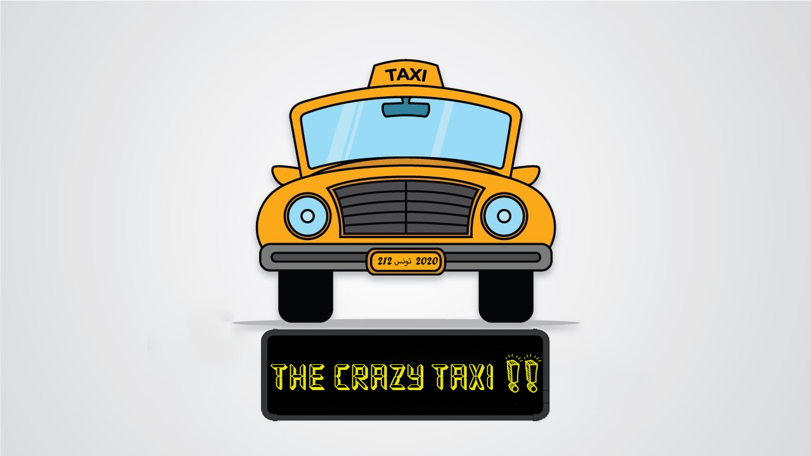

<h1 align="center">Crazy Taxi</h1>

## 🎯 About

Crazy Taxi is a 2d racing video game. Each game the player assume the role of a taxi driver who must accumulate money by collecting coins while dodging obstacles and escaping from police.

Go try it and please let me know if you enjoyed it with a ⭐️, I would appreciate it a lot.

## ▶️ Demo
Here you can find the demo link:
-[Demo](CMakeFiles/demo_xUuneOQ0.mp4)

## Contribution

Thank you for your interest in our project. There are many ways to contribute,
and we appreciate all of them :

- Source code
- Unit tests
- Bug Reports
- Documentation
- Localization (Translation)
- etc

Contributions should be under the terms of the MIT license [&lt;LICENSE&gt;](LICENSE).

## How to build

> See [BUILD.md](BUILD.md)

## Authors / Contributors

The project was originally developed by:

- [Amine Ben Hassouna](https://github.com/aminosbh)
- [Ahmed Belghith](https://github.com/Ahmed2021B)

## 📝 License

[MIT](https://github.com/Ahmed2021B/Crazy-Taxi/blob/main/LICENSE)

